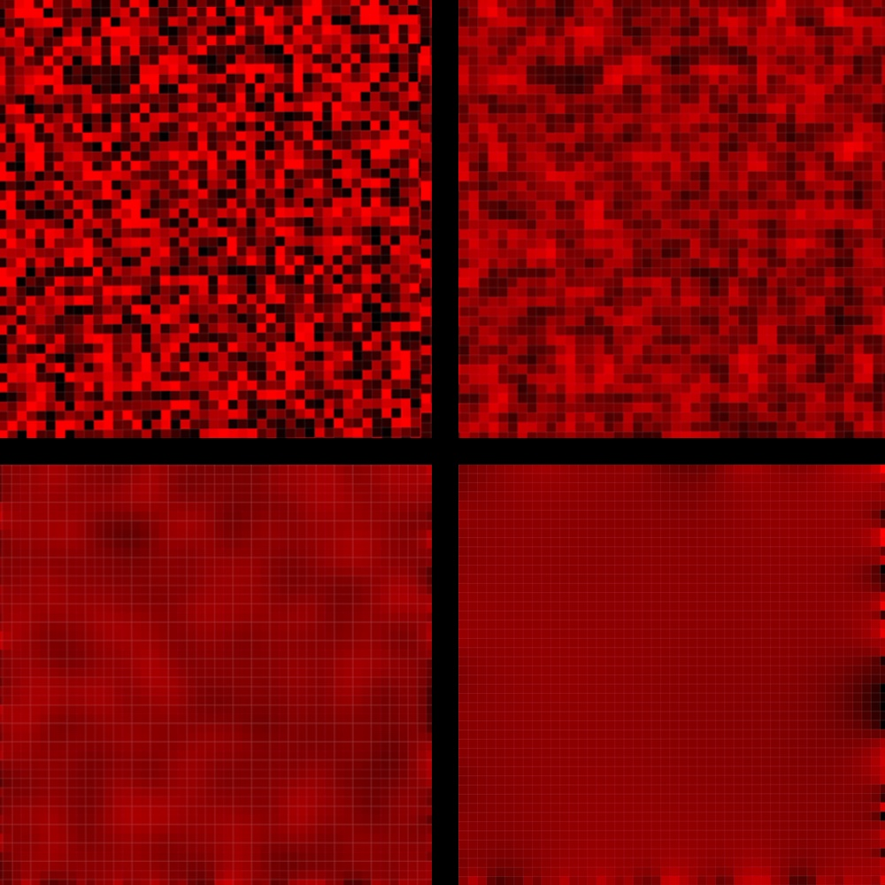

# CellGrid

The CellGrid package provides a type for representing
a rectangular grid of cells.  

```
type CellGrid a
    = CellGrid ( Int, Int ) (Array a)
```

Two applications are given in 
the `examples` folder: Conway's game of life, and a simulation
of heat conduction.  In the first example, we use the type 
`CellGrid State`, where 

```
type State = Occupied | Unoccupied
```

In the second, we use `CellGrid Float`.  The idea is the
cell contents (the floating point number) represents 
the temperature of the cell.

One can create a CellGrid, transform it, and render it both SVG 
and HTML, as in the figure below (taken from the simulation in 
examples/HeatEquation)




## Creating a CellGrid

In the example below, we create a 2x2 `CellGrid Float`.


````
> import CellGrid exposing(..)
> import Array exposing(Array)
```

```
> cells = Array.fromList [1.0,2.0,3.0,4.0]
Array.fromList [1,2,3,4]
    : Array Float
```
    
```
> cg = CellGrid (2,2) cells
CellGrid (2,2) (Array.fromList [1,2,3,4])
    : CellGrid Float
```

Elements of a `CellGrid` can be accessed as one expects
in a 2D array:

```
> cellAtIndex (1,1) cg
Just 4 : Maybe Float
```

## Rendering a CellGrid

Render a `CellGrid` using the function

```
renderAsHtml : CellRenderer a -> CellGrid a -> Html msg
```

where one has 

```
type alias CellRenderer a = {
       cellSize : Float
     , cellColorizer : a -> ColorValue
     , defaultColor : ColorValue
  }
```

A `ColorValue` is a type alias for `String`.  Here is a typical
`CellRenderer`: 

```
cellrenderer : CellRenderer Float
cellrenderer =
    {
         cellSize = 15
       , cellColorizer = \z -> 
           "rgb(" ++ String.fromFloat (255*z) ++ ", 0, 1)"
       , defaultColor = "rgb(0, 0, 0)"
    }
```

For a `CellGrid Float`, the contents of a cell is real number. 
The above `cellColorizer` function converts cell contents to a 
string that SVG understands as representing an RGB color, in this
case, a shade of red.  See `examples/HeatEquation/Main.elm` for 
an illustration of how this is used.

By using cellColorizers, one can render any kind of CellGrid.   
For example, in Conway's Game of Life,  one  uses the function


```
cellrenderer : CellRenderer State
cellrenderer =
    {
         cellSize = 15
       , cellColorizer = \state -> 
            case state of
               Occupied -> "red" 
               Unoccupied -> "black"
       , defaultColor = "black"
    }
```
